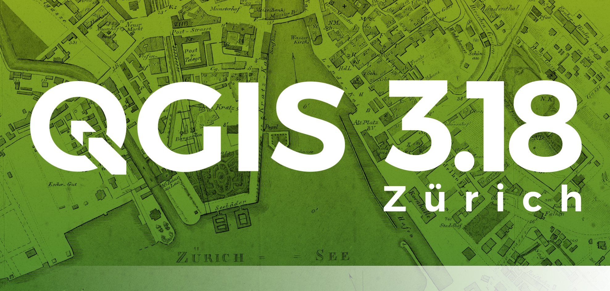

# GeoBreack 28 by Gter

GeoBreak 28 - alla scoperta delle espressioni di QGIS

---

**INDICE**

<!-- TOC -->

- [GeoBreack 28 by Gter](#geobreack-28-by-gter)
  - [Relatore](#relatore)
  - [Data, luogo e durata](#data-luogo-e-durata)
  - [Piattaforme e Software](#piattaforme-e-software)
  - [Programma - in lavorazione](#programma---in-lavorazione)
  - [QGIS e le espressioni](#qgis-e-le-espressioni)
  - [Contatti](#contatti)
    - [Totò Fiandaca](#totò-fiandaca)
      - [Sitografia](#sitografia)
- [GeoBreak 28](#geobreak-28)
- [Riferimenti utili](#riferimenti-utili)
- [Cosa c'è in questo repo](#cosa-cè-in-questo-repo)

<!-- /TOC -->

---

**TITOLO**:   Alla scoperta delle espressioni di [QGIS](https://qgis.org/it/site/): come e dove usarle.

**DESCRIZIONE**:   Obiettivo di questo GeoBreak è quello di evidenziare le potenzialità delle espressioni di **QGIS**: come usarle, dove usarle e perché non possiamo fare a meno del Field Calc di QGIS.

---

## Relatore

- 👨‍🦲 **Totò FIANDACA**  (Membro [OpenDataSicilia](http://opendatasicilia.it/) (2014) , Membro [QGIS Italia](http://qgis.it/) (2015), Socio [GFOSS.it](https://gfoss.it/) (2017), Membro [QGIS organization](https://github.com/qgis) (2020) | Ideatore della Guida [#HfcQGIS](http://hfcqgis.opendatasicilia.it/it/latest/) (2018))

## Data, luogo e durata

- 🗓 23/06/2021 con orario  🕟 08.30 🕢 09.30 
- 🌐 on-line
- ⏳ una ora

## Piattaforme e Software

- [ZOOM](https://zoom.us/) - per diretta web
- Windows 10 64b - come SO
- [`QGIS 3.18 Zürich`](https://qgis.org/it/site/)

## Programma - in lavorazione

1. Cosa sono le espressioni di QGIS;
2. dove posso utilizzarle;
3. come posso utilizzarle;
4. sintassi;
5. ...

[↑ torna su ↑](#geobreack-28-by-gter)

## QGIS e le espressioni

[↑ torna su ↑](#geobreack-28-by-gter)

## Contatti

### Totò Fiandaca

* **Mail**: <pigrecoinfinito@gmail.com>
* **Facebook**: <https://www.facebook.com/pigreco314>
* **Twitter**: <https://twitter.com/totofiandaca>

#### Sitografia

* **blog**: <https://pigrecoinfinito.com/>
* **canale youtube**: <http://www.youtube.com/c/TotòFiandaca>
* **HfcQGIS**: <http://hfcqgis.opendatasicilia.it/it/latest/index.html>
* **Tansignari**: <http://tansignari.opendatasicilia.it/it/latest/#>
* **data.world**: <https://data.world/pigrecoinfinito>
* **github**: <https://github.com/pigreco>
* **gitlab**: <https://gitlab.com/pigr3co>
* **Canale Telegram** : <https://t.me/pigrecoinfinito>

[↑ torna su ↑](#geobreack-28-by-gter)

# GeoBreak 28

# Riferimenti utili

- **QGIS** : <https://qgis.org/it/site/>
- **Repo QGIS** : <https://github.com/qgis/QGIS/blob/master/README.md>
- **Plugin Gimp Selection Feature** : <https://plugins.qgis.org/plugins/gimpselectionfeature_plugin/>
- **Plugin Magic Wand** : <https://plugins.qgis.org/plugins/MagicWand-master/>
- **Consultazione cartografia catastale - WMS** : <https://www.agenziaentrate.gov.it/portale/web/guest/schede/fabbricatiterreni/consultazione-cartografia-catastale/servizio-consultazione-cartografia>
- **Font Trueno** : <https://www.wfonts.com/font/trueno>
- **Visual Style Guide** : <https://www.qgis.org/en/site/getinvolved/styleguide.html#trueno-fonts>
- **Visual Studio Code** : <https://code.visualstudio.com/>
- **onData** : <https://ondata.it/>
- **OpenDataSicilia** : <http://opendatasicilia.it/>

[↑ torna su ↑](#geobreack-28-by-gter)

# Cosa c'è in questo repo

- cartella `imgs` contiene le immagini utilizzate nel progetto .qgs;
- cartella `risorse` contiene i file utilizzati nel progetto, come:
- file `license` è il file che definisce la licenza del repository;
- file `README.md` è questo file, con le info.

[↑ torna su ↑](#geobreack-28-by-gter)

